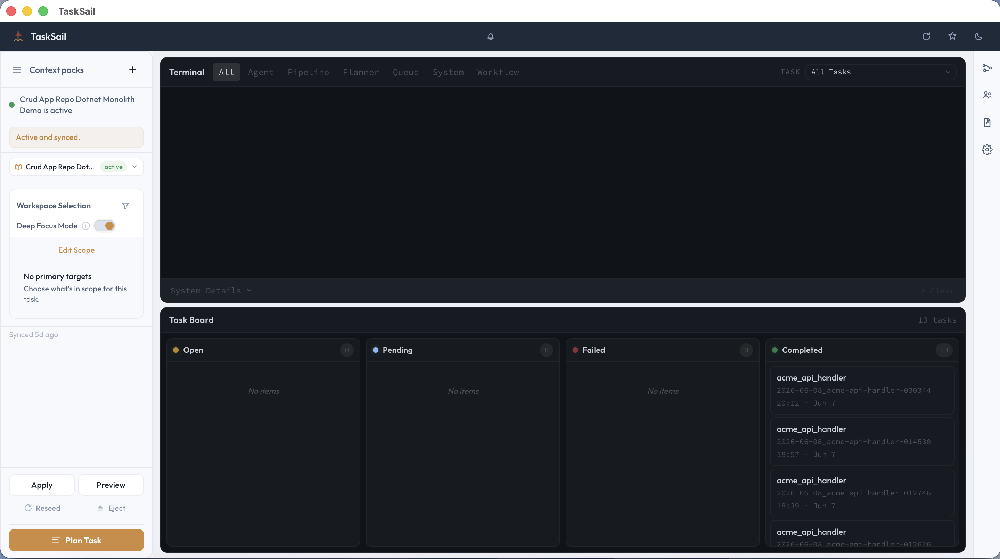

# What Is TaskSail?

TaskSail is a Unix-based, UI-driven agentic workbench for spec-driven development. You use the desktop app to turn a request into a bounded task spec, then TaskSail runs an automated agentic loop for planning, implementation, verification, and closeout.

The point of the loop is to anchor the agent's work. Context packs define the source scope, task artifacts define the expected outcome, and verification routes problems back through the implementation path. That makes the work more repeatable; it does not guarantee that every agent result is correct.

You stay in control. TaskSail does not move your work into a hosted service. It runs from your checkout, uses local configuration, and launches the configured agent provider from your machine.

TaskSail currently targets Unix-based systems such as Linux and macOS. Windows is not supported today.

## The Team You See

- Lily helps shape the request before work starts.
- Alice turns the request into a professional task and implementation plan.
- Dalton implements the work.
- Ron checks the result and routes it back for fixes or closeout.

The names make the workflow easier to follow in the app. The actual rules live in the repository and are enforced by local platform checks.

## The Normal Flow

1. Install the prerequisites.
2. Run setup and validation.
3. Launch the desktop app.
4. Select or create a context pack so TaskSail knows which codebase the agents may work on.
5. Draft and review a task spec in the planner.
6. Watch the task move through the board and terminal feed.
7. Review the result before you accept follow-up work.

Continue with [Install Prerequisites](01-install-prerequisites.md).
