# TaskSail — Visual Walkthrough

> Auto-generated on 2026-04-17 by Playwright screenshot automation.

This document provides a visual tour of every major screen and modal in the TaskSail desktop application.

---

## App Shell — Idle State

The main TaskSail window on startup. Shows the header bar with status chips, the collapsed sidebar on the left, the central Task Board workspace, and the config rail stack on the right.

---

## Theme — dark Mode

After toggling the theme to dark mode. All CSS variables update instantly via the data-theme attribute.

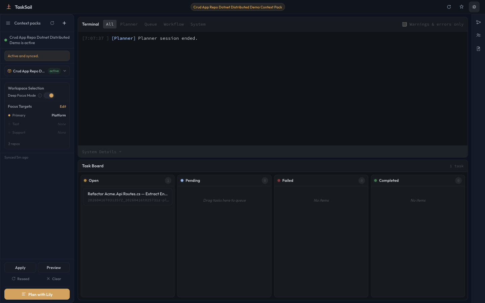

---

## Context Pack Sidebar — Expanded

The left sidebar expanded showing the context pack list, activation controls, and deep-focus selection tray.

---

## Deep Focus — Summary

The Deep Focus section showing the Workspace Selection panel with the Deep Focus Mode toggle, focus targets, test target, and support targets. Deep Focus narrows the agent workspace scope to specific directories.

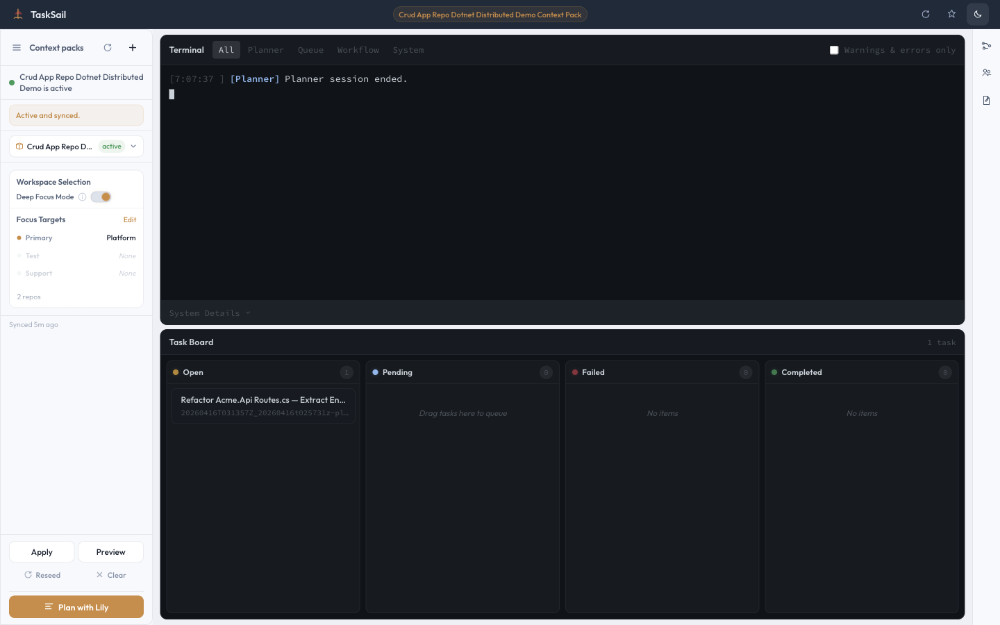

---

## Deep Focus — Editor

The Deep Focus editor showing the full directory tree with expandable nodes. Operators can drill into the repository structure and select specific files or directories as focus targets, test targets, or support targets.

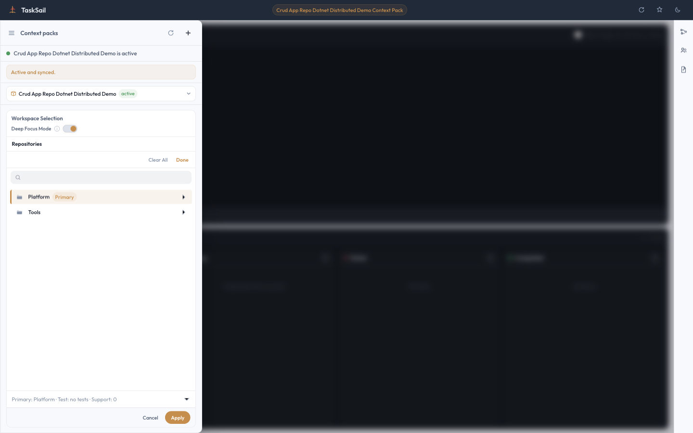

---

## Planner Modal — Idle

The Planning modal in its idle state. Shows the conversation area, footer buttons (Preview Plan, Submit to Queue), the attach button, and the Bypass Lily group for uploading a pre-written spec.

---

## Planner Modal — With Input

The operator has typed a task description. The Submit to Queue button becomes active when there is content to send.

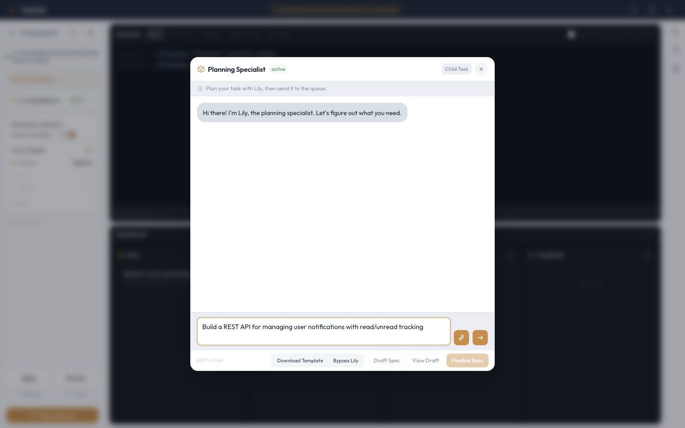

---

## Agent Configuration Modal

The Agent Configuration modal showing the named workflow agents: Lily (Planning), Alice (PM), Dalton (SWE), Dalton-Verify, and Ron (QA). Each agent has a sprite avatar and configurable parameters.

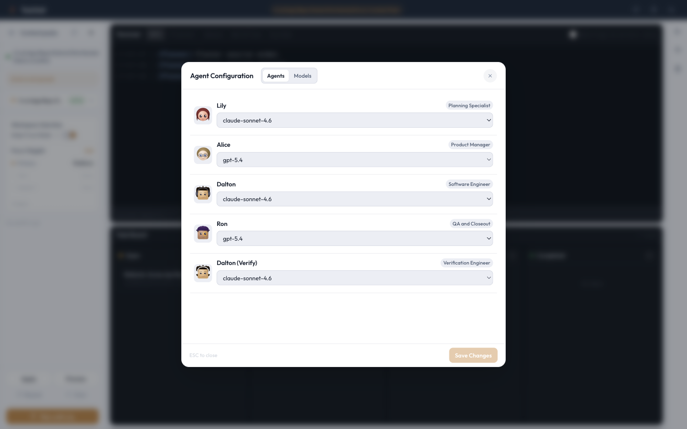

---

## Agent Configuration — Models

The Agent Configuration modal Models tab showing the model catalog. Lists available LLM models with their IDs and allows adding or removing models from the catalog.

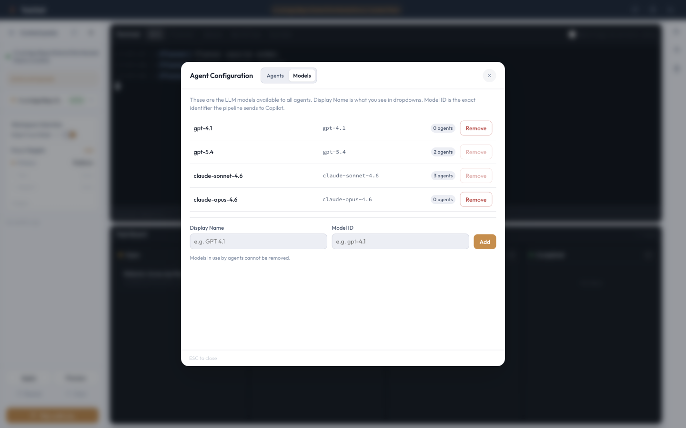

---

## MCP Configuration Modal

The MCP (Model Context Protocol) server configuration modal. Shows enabled/disabled MCP servers, connection status, and allows adding new external MCP endpoints.

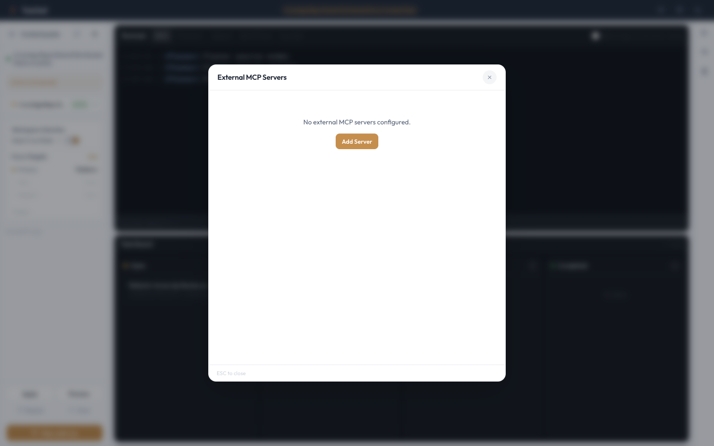

---

## Add MCP Server

The Add MCP Server form for registering a new external MCP endpoint. Fields include server name, SSE URL, optional headers for authentication, and agent assignment toggles.

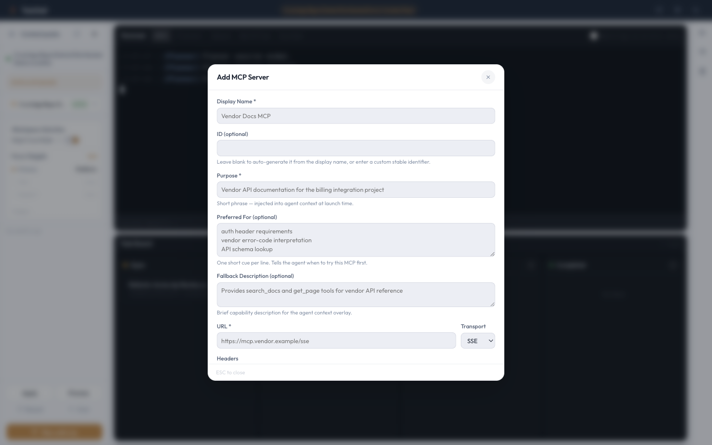

---

## Agent Instructions Browser

The Agent Instructions browser showing per-role instruction markdown files from .github/copilot/instructions/. Allows viewing and editing role-specific prompts.

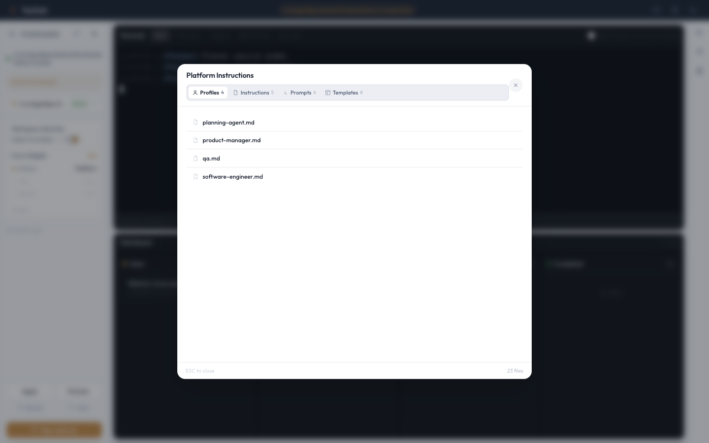

---

## Reinforcement Modal — Overview

The Reinforcement modal showing the overview panel with task stats, total reward, streak, and per-agent cards. This is the operator feedback and reinforcement learning hub.

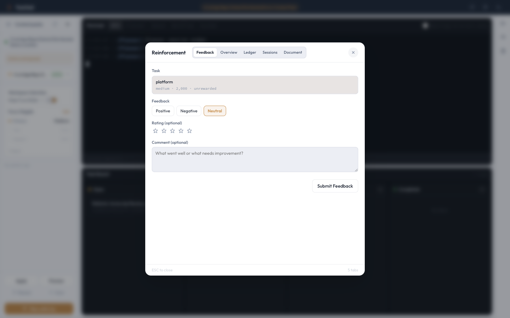

---

## Reinforcement — Overview

The Reinforcement modal Overview tab showing specialized controls for operator feedback and agent alignment.

---

## Reinforcement — Ledger

The Reinforcement modal Ledger tab showing specialized controls for operator feedback and agent alignment.

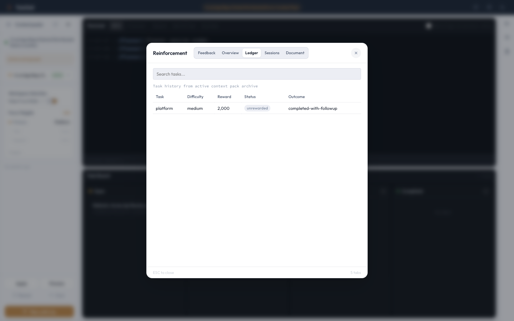

---

## Reinforcement — Sessions

The Reinforcement modal Sessions tab showing specialized controls for operator feedback and agent alignment.

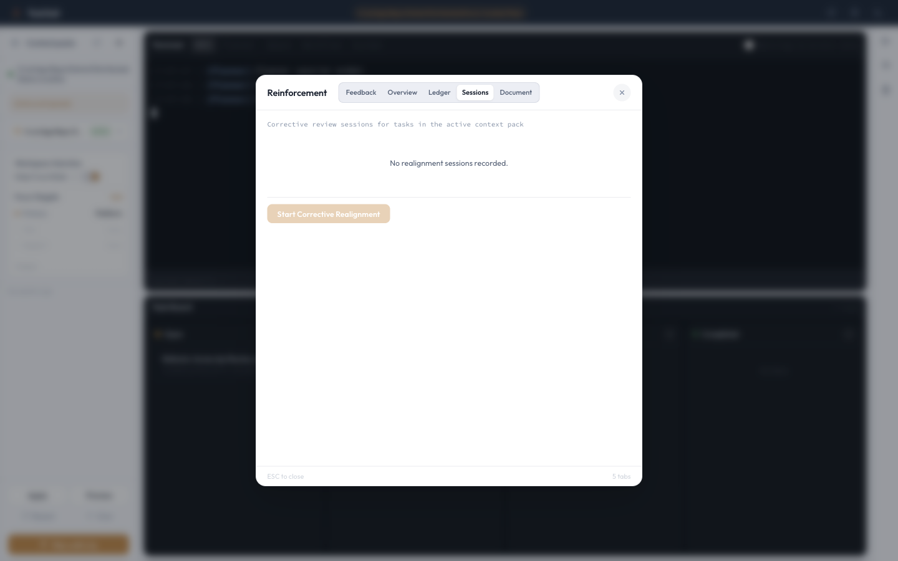

---

## Task Board — With Tasks

The Task Board showing task cards organized into columns: Open, Pending, Active, Complete, and Error. Cards can be dragged between columns.

---

## Task Detail Modal

The Task Detail modal showing the full markdown content of a selected task card. Includes the task title, metadata, and rendered markdown body.

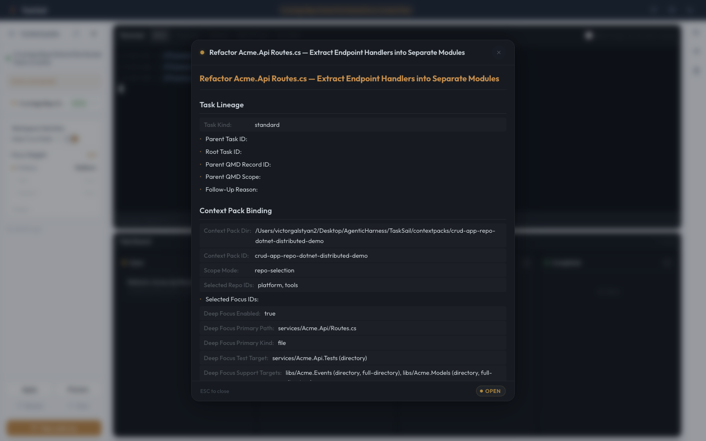

---

## Task Board — Task Moved to Pending

After dragging a task card from the Open column to the Pending column. The task is now queued for execution by the agent pipeline. When the dropbox watcher picks it up, it transitions to Active and the workflow begins.

---

## Terminal — Agent Activity

The Terminal Feed showing live agent output after a task was moved to the Pending queue and activated. Timestamped entries show which agent is running and its current progress.

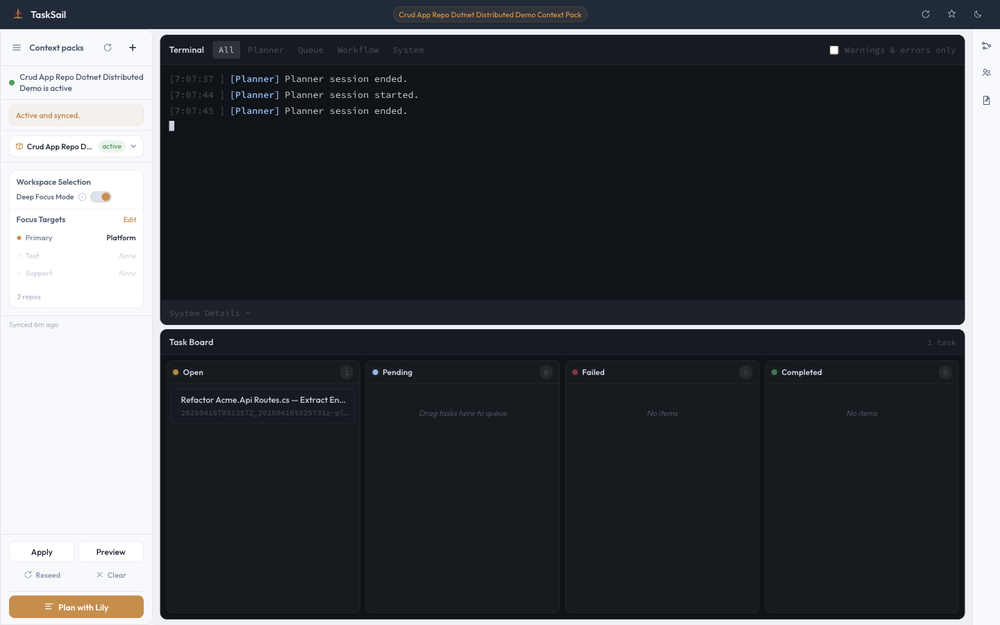

---

## Terminal Feed

The Terminal Feed showing real-time agent output and lifecycle events. Displays timestamped log entries from the workflow pipeline.

---

## Additional States (Not Captured)

The following states require a running backend pipeline or specific task queue state to capture:

- **Sail Screen** — The animated send-off screen shown after submitting a task to the queue. Displays a randomized motivational phrase.
- **Planner Active Session** — A live conversation with Lily (the planning agent) showing real-time streaming responses.
- **QA Remediation Loop** — The Task Board showing a task cycling between QA → SWE → QA columns.

